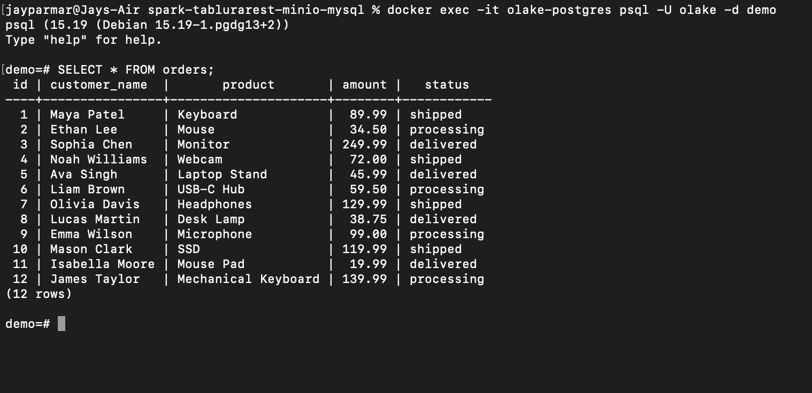
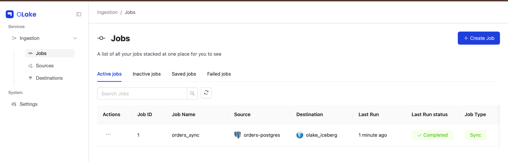
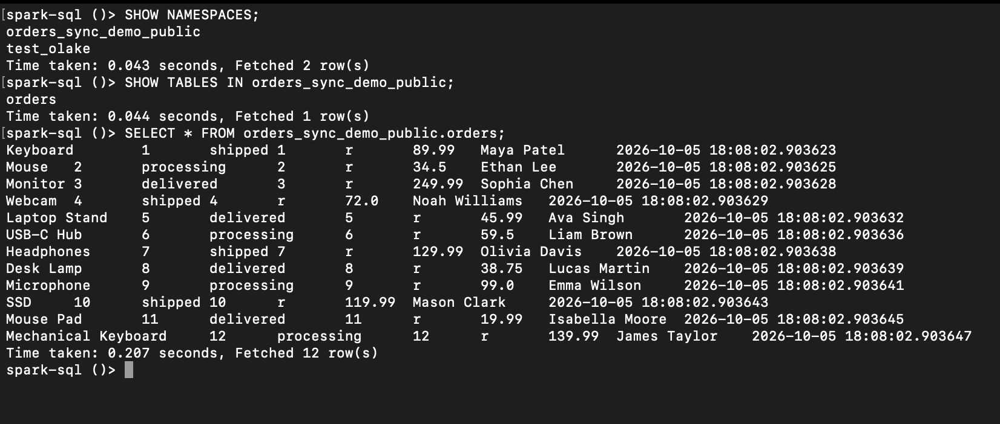

# OLake Postgres to Iceberg Demo

This is a small demo I made to test OLake by moving data from PostgreSQL into Apache Iceberg and then querying it using Spark SQL.

The pipeline is:

PostgreSQL -> OLake -> Iceberg REST Catalog -> MinIO -> Spark

## Setup

I used Docker for the local setup.

### PostgreSQL

I started a local PostgreSQL container and created a small `orders` table.

```sql
CREATE TABLE orders (
    id SERIAL PRIMARY KEY,
    customer_name VARCHAR(100),
    product VARCHAR(100),
    amount DECIMAL(10,2),
    status VARCHAR(30)
);
```

I added 12 sample rows.

To verify the source data:

```sql
SELECT * FROM orders;
```



## OLake

I ran OLake locally using Docker.

I created:

- a PostgreSQL source
- an Apache Iceberg destination
- a sync job called `orders_sync`

For the source I used the local Postgres database and standalone mode.

For the destination I used Apache Iceberg with a Generic REST catalog and MinIO as local object storage.

The job synced the `public.orders` table into Iceberg.



## Querying with Spark

After the sync finished, I opened Spark SQL.

First I checked the namespaces:

```sql
SHOW NAMESPACES;
```

OLake created:

```text
orders_sync_demo_public
```

Then I checked the tables:

```sql
SHOW TABLES IN orders_sync_demo_public;
```

The `orders` table was available.

Finally I queried it:

```sql
SELECT * FROM orders_sync_demo_public.orders;
```

Spark returned all 12 rows from the original Postgres table.



## Gotchas

The biggest issue I ran into was Docker networking.

At first I used:

```text
http://iceberg-rest:8181
```

for the REST catalog URL.

OLake could not resolve that hostname because the OLake containers and the Iceberg REST container were on different Docker networks.

The error was:

```text
UnknownHostException: iceberg-rest
```

I changed the REST catalog URL to:

```text
http://host.docker.internal:8181
```

and changed the MinIO endpoint to:

```text
http://host.docker.internal:9000
```

After that the connection worked.

Another small thing that confused me was the catalog naming. I was expecting an option called REST Catalog, but in the UI the option was called `Generic REST`.

## Feedback

A few things I would change or improve:

- Make the local REST catalog setup more obvious in the main docs.
- Explain Docker networking a little more clearly, especially when to use container names versus `host.docker.internal`.
- Give one very simple example showing the difference between standalone, incremental, and CDC.
- The playground setup was helpful because it already included Spark, MinIO, and the Iceberg REST catalog.

Overall, once I got the services talking to each other, the actual sync was straightforward.